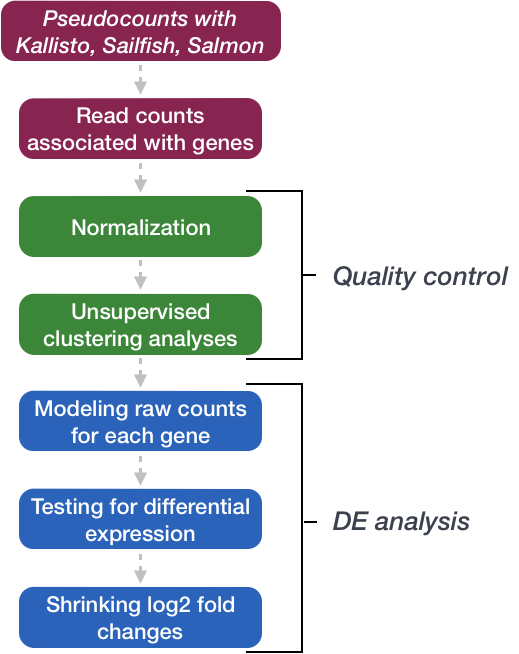
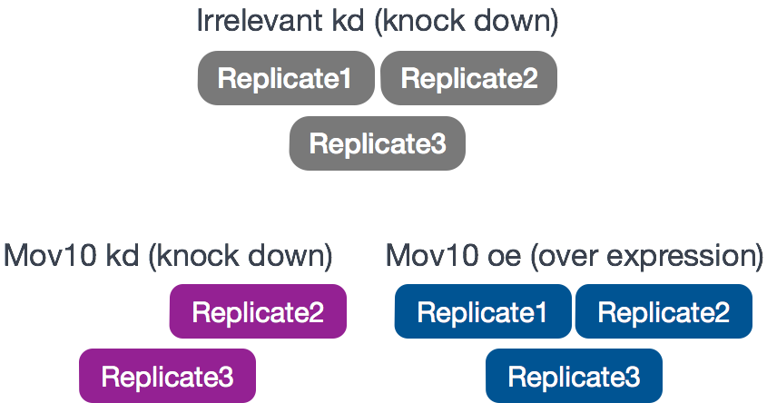
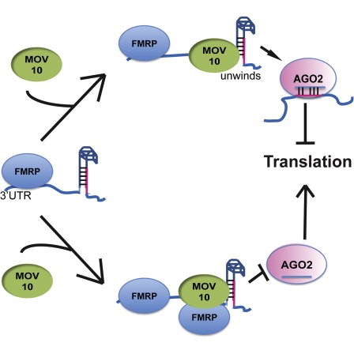
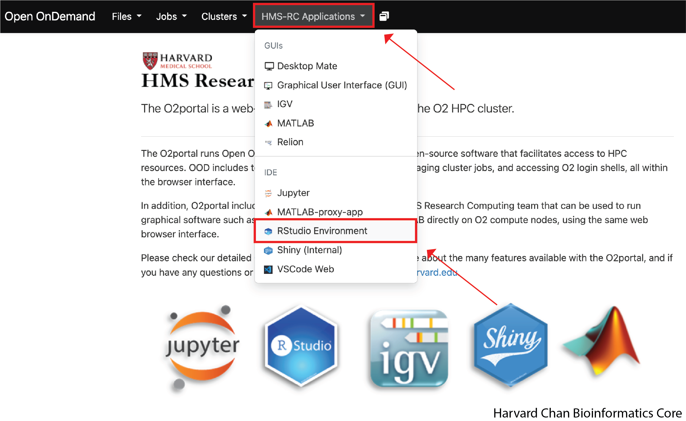
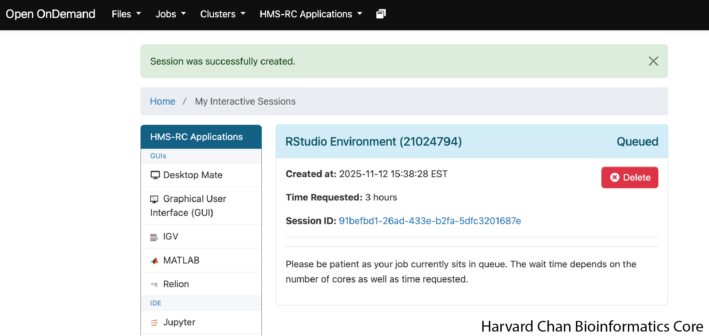
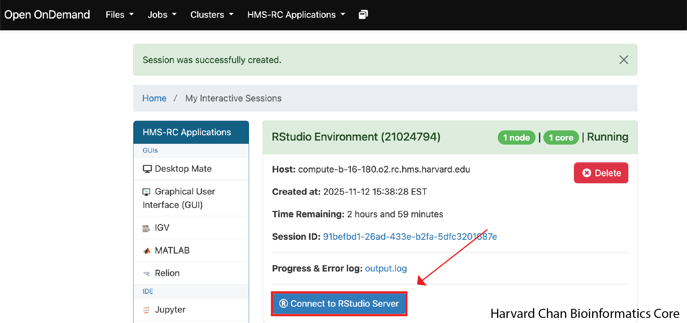
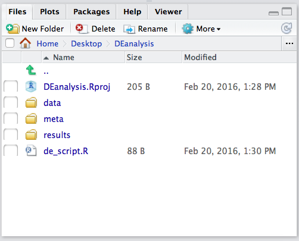
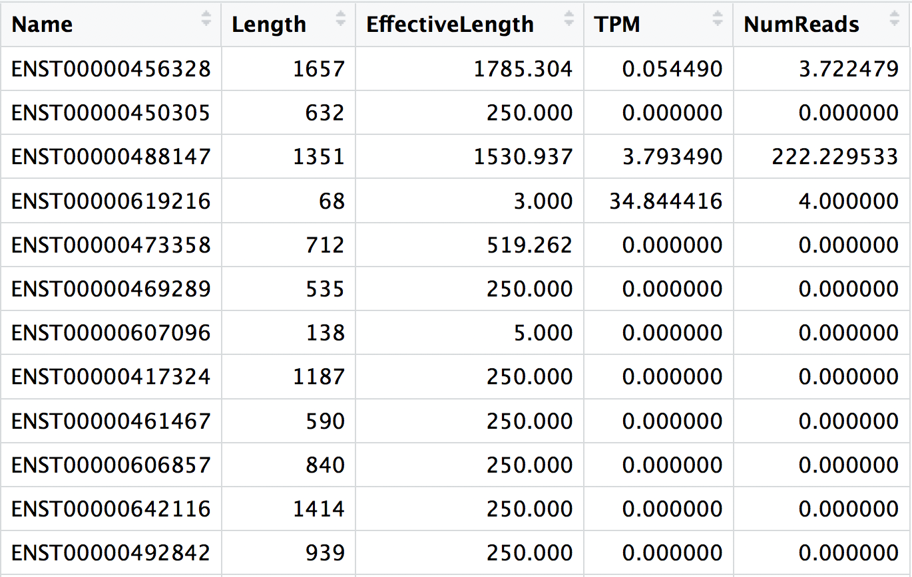

Approximate time: 60 minutes

## Learning Objectives 

In this lessons, you will:

- Describe the RNA-seq and differential gene expression analysis workflows
- Explain the experiment and its objectives
- Create a project in R 
- Set up for the analysis of RNA-seq data

## Differential gene expression analysis

Over the past decade, RNA sequencing (RNA-seq) has become an indispensable tool for transcriptome-wide analysis of differential gene expression and differential splicing of mRNAs ([Stark R et al., 2019](https://www.nature.com/articles/s41576-019-0150-2)). The correct identification of which genes/transcripts are changing in expression between specific conditions is key in our understanding of the biological processes that are affected.

In this workshop, we will walk you through an **end-to-end gene-level RNA-seq differential expression workflow** using various R packages. We will start with reading in data obtained from Salmon, convert pseudocounts to counts, perform exploratory data analysis for quality assessment and to explore the relationship between samples, perform differential expression analysis, and visually explore the results prior to performing downstream functional analysis.

<p align="center">

</p>

## Review of the dataset

For this workshop, we will be using a publicly available RNA-seq dataset that is part of a larger study described in [Kenny PJ et al., 2014](http://www.ncbi.nlm.nih.gov/pubmed/25464849). 

The RNA-seq was performed on HEK293F cells that were transfected either with a MOV10 transgene, siRNA to knock down Mov10 expression, or non-specific (irrelevant) siRNA. This resulted in 3 conditions **Mov10 oe** (over expression), **Mov10 kd** (knock down) and **Irrelevant kd**, respectively. The number of replicates is as shown below.

Using these data, we will evaluate transcriptional patterns associated with perturbation of MOV10 expression. Please note that the irrelevant siRNA will be treated as our control condition.

<p align="center">

</p>

::: callout-note
## What is the purpose of these datasets? What does Mov10 do?

The authors are investigating interactions between various genes involved in Fragile X syndrome, a disease in which there is aberrant production of the FMRP protein. 

**FMRP**, a protein that is “most commonly found in the brain, is essential for normal cognitive development and female reproductive function. Mutations of this gene can lead to fragile X syndrome, intellectual disability, premature ovarian failure, autism, Parkinson's disease, developmental delays and other cognitive deficits.” - from [Wikipedia](https://en.wikipedia.org/wiki/FMR1)

**MOV10** is a putative RNA helicase that is also associated with **FMRP** in the context of the microRNA pathway.
:::

**The hypothesis [the paper](http://www.ncbi.nlm.nih.gov/pubmed/25464849) is testing is that FMRP and MOV10 associate and regulate the translation of a subset of RNAs.**

<p align="center">

</p>

**Our questions:**

- What patterns of expression can we identify with the loss or gain of MOV10? 
- Are there any genes shared between the two conditions?

## RNA-seq workflow

For this dataset, raw sequence reads were obtained from the [Sequence Read Archive (SRA)](https://www.ncbi.nlm.nih.gov/sra/?term=SRP029367). These reads were then processed using the RNA-seq workflow as detailed in the [pre-reading for this workshop](01_RNAseq_processing_workflow.html). All steps were performed on the command line (Linux/Unix), including a thorough quality control assessment. If you are interested, we have the **MultiQC html report for this dataset [linked here](https://www.dropbox.com/scl/fi/btv3itmk81z2omwijzyaz/multiqc_report_rnaseq.html?rlkey=w3zkxuy93szld0s9y2dq5cu8q&st=9oiwbrlq&dl=1)** for you to peruse.

The directories of output from the mapping/quantification step of the workflow (Salmon) is the data that we will be using. These transcript abundance estimates, often referred to as **'pseudocounts', will be the starting point for our differential gene expression analysis**.

## Setting up

Let's get started by opening up RStudio and setting up a new project for this analysis. Select the tab appropriate for your learning:

::: {.panel-tabset}

### Local

1. Go to the `File` menu and select `New Project`.
2. In the `New Project` window, choose `New Directory`. Then, choose `New Project`. Name your new directory `DEanalysis` and then "Create the project as subdirectory of:" the Desktop (or location of your choice).
3. The new project should automatically open in RStudio. 

<p align="center">

</p>

To check whether or not you are in the correct working directory, use `getwd()`. The path `Desktop/DEanalysis` should be returned to you in the console. Within your working directory, use the `New folder` button in the bottom right panel to create two new directories: `meta` and `results`. Remember the key to a good analysis is keeping organized from the start! (*NOTE: we will be downloading our `data` folder.*)

Now we need to grab the files that we will be working with for the analysis. There are two things we need to download. 

1. First we need the **Salmon results for the full dataset**. *Left-click on the links below to download the data directly. Once they have been downloaded, move them into your project directory:*

  - [Salmon data](https://www.dropbox.com/scl/fi/t2oirdy6qm0poy3uix5l6/data.zip?rlkey=xy39cwhjxectjp2y3txktcath&st=5i94dte0&dl=1) for the Mov10 full dataset

  Once you have the zip file downloaded you will want to decompress it. This will create a `data` directory with sub-directories that correspond to each of the samples in our dataset.

2. Next, we need the **annotation file** that maps our transcript identifiers to gene identifiers. We have created this file for you using the R Bioconductor package [AnnotationHub](https://bioconductor.org/packages/release/bioc/html/AnnotationHub.html). For now, we will use it as is, but later in the workshop we will spend some time showing you how to create one for yourself. *Again left-click the to download the data directly and then move the downloaded file into the `data` folder in your project directory.*

  - [Annotation file](https://www.dropbox.com/scl/fi/8qk2udv283l624ch6w3is/tx2gene_grch38_ens94.txt?rlkey=v47rdu1z11mlfvtvj1nzw2zy4&st=36yoijs1&dl=1)

### O2 Portal

In this workshop, we will be doing our data analysis on the O2 cluster. The O2 cluster is hosted by HMS-RC and they have created training accounts for us to use. Using a high-performance computing cluster like O2 for our analysis offers several advantages over carrying out our analyses locally:

- Able to support higher memory projects
- Data and analyses are stored on a secure, remote server with back-ups
- Your data likely already resides on a high-performance computing cluster

Additionally, from a learning perspective it is helpful because we can ensure that everyone has the same:

- Version of R and packages
- File structure

While also allowing us the ability to log into your account to help with troubleshooting a problem.

Now that we have a grasp for why we might like to use a high-performance computing cluster for our analysis, let's go ahead and log into the O2 Portal. We can do that by going to:

[https://o2portal.rc.hms.harvard.edu/](https://o2portal.rc.hms.harvard.edu/)

Next, it will ask you to log in using your "HMS account ID or Affiliate email address". In order to find this, please look your name up on the Google Sheet that we e-mailed to your prior to the workshop. Next, enter your password, which can also be found in the Google Sheet.

Once logged in, you will be on the O2 Portal landing page. In order to start an RStudio session:

1. From the Navigation Bar at top of the webpage select the dropdown menu "HMC-RC Applications"
2. Next, select "RStudio Environment" from the dropdown menu

{width=500px fig-align="center"}

3. Change "WallTime requested in hours" from 1 to 3 hours
4. Change "Total Memory in GB(not per core)" from 1 to 8GB
5. Confirm that "Modules to be loaded" is "gcc/14.2.0 R/4.4.2"
6. Click on "Show advanced settings..." and under "Shared R Personal Library", paste `/n/groups/hbctraining/R/4.4.2/DGE`. This will allow us to share a common library of packages.
7. Click the Launch button.

It may take a few minutes in order to be allocated the resources and your screen will look like this:

{width=500px fig-align="center"}

Once your resources have been allocated, your job will change from "Queued" to "Starting" to "Running". Once it is running, it should look like this:

{width=500px fig-align="center"}

Select the "Connect to RStudio Server" button and it should load a RStudio window. Each time you log into the O2 portal you will need to undergo these previous steps to request resources from the computing cluster. 

Now that we have a RStudio window, let's copy the R Project over that we will be using for this workshop. In the console, enter:

```{r}
#| label: copy_project
#| eval: false
system("cp -r /n/groups/hbctraining/DEanalysis/ ~")
```

In your "Files" tab, you should now see a folder called "DEanalysis". Click on "DEanalysis" and click the R Project "DEanalysis.Rproj". This should restart your R Studio with this R project. 

:::{.callout-note}
There are a few things to be aware of when using a HPCC for data analysis:

- Walltime is the amount of time that you have been allocated resources. When this time expires, you will be kicked off resources regardless of where you are in your analysis, so being cognizant of how much time you have used is important when doing an analysis on an HPCC.
- When using many HPCCs that have an Open OnDemand Portal like O2, when your job ends, the global environment is wiped clean. So unlike when you are working locally on RStudio and you close RStudio, the data in your environment will be removed. In order to maintain this data, we will be using the `save.image("DEanalysis.Rdata")` function throughout the workshop at the end of each lesson to save our progress. You can use it more frequently than that if you would like.
- When starting a new session on O2, you will want to run `load("DEanalysis.Rdata")` in order to load your environment back.
- We are using the `/n/groups/hbctraining/R/4.4.2/DGE` library for our analysis in this workshop, but we would **NOT recommend** to users that they use it for their own analyses. This is for a two reasons:
  - While we try to keep the software current, there are no promises that it is is the most current versions of a packages
  - The HBC Training Team could update the packages at any time and without warning, so if half of your analysis was done in an older version of a package and the other half was done in a newer half, you might have trouble figuring that out if your results aren't concordant.

:::
:::

Finally, go to the `File` menu and select `New File`, then select `R Script`. This should open up a script editor in the top left hand corner. This is where we will be typing and saving all commands required for this analysis. In the script editor, type in header lines:

```{r}
#| label: header
#| eval: false
# HBC RNA-seq DGE workshop
# Gene-level differential expression analysis using DESeq2
```

Now save the file as `de_script.R` within your project directory. When finished, your project directory should now look similar to this:



## Loading libraries

For this analysis we will be using several R packages, some which have been installed from CRAN and others from Bioconductor. To use these packages (and the functions contained within them), we need to **load the libraries.** Add the following to your script and don't forget to comment liberally!

```{r}
#| label: load_libraries
#| warning: false
#| message: false

# Setup
# Bioconductor and CRAN libraries used
library(DESeq2)
library(tidyverse)
library(RColorBrewer)
library(pheatmap)
library(DEGreport)
library(tximport)
library(ggplot2)
library(ggrepel)
```

### Loading data

The main output of Salmon is a `quant.sf` file, and we have one of these for each individual sample in our dataset. A screenshot of the file is displayed below:



For each transcript that was assayed in the reference, we have:

1. The transcript identifier
2. The transcript length (in bp)
3. The effective length (described in detail below) 
4. TPM (transcripts per million), which is computed using the effective length
5. The estimated read count ('pseudocount')

:::{.callout-note}
## What exactly is the effective length?

The effective length for a transcript is the essentially **the number of possible start positions for a read or fragment within that transcript**. The sequence composition of a transcript affects how many reads are sampled from it. While two transcripts might be of identical actual length, depending on the sequence composition we are more likely to generate fragments from one versus the other. The transcript that has a higher likelihood of being sampled will end up with the larger effective length. The effective length is transcript length that has been "corrected" to include factors due to sequence-specific and GC biases.
:::

We will be using the R Bioconductor package `tximport` to prepare the `quant.sf` files for DESeq2. The first thing we need to do is create a variable that contains the paths to each of our `quant.sf` files. Then we will **add names to our quant files, which will allow us to easily distinguish between samples in the final output matrix**.

```{r}
#| label: load_data
# List all directories containing data  
samples <- list.files(path = "./data", full.names = TRUE, pattern = "salmon$")

# Obtain a vector of all filenames including the path
files <- file.path(samples, "quant.sf")

# Since all quant files have the same name, it is useful to have names for each element
names(files) <- str_replace(samples, "./data/", "") %>% 
                str_replace(".salmon", "")
```

Our Salmon index was generated with transcript sequences listed by Ensembl IDs, but `tximport` needs to know **which genes these transcripts came from**. We will use the annotation table that we downloaded to extract transcript to gene information. 

```{r}
#| label: load_annotations
# Load the annotation table for GrCh38
tx2gene <- read.delim("./data/tx2gene_grch38_ens94.txt")

# Take a look at it 
tx2gene %>% head()
```

**`tx2gene`** is a three-column **data frame linking transcript ID (column 1) to gene ID (column 2)** to gene symbol (column 3). We will take the first two columns as input to `tximport`. The **column names are not relevant, but the column order is (i.e., transcript ID must be first).**

Now we are ready to **run `tximport`**. 

```{r}
#| label: tximport_about
#| eval: false

?tximport # let's take a look at the arguments for the tximport function
```

The `tximport()` function imports transcript-level estimates from various external software (e.g., Salmon, Kallisto) and summarizes to the gene-level (default) or outputs transcript-level matrices. There are optional arguments to use the abundance estimates as they appear in the `quant.sf` files or to calculate alternative values.

For our analysis we **need non-normalized or "raw" count estimates at the gene-level for performing DESeq2 analysis**. 

Since the gene-level count matrix is a default (`txOut=FALSE`) there is only one additional argument for us to modify **to specify how to obtain our "raw" count values**. The options for `countsFromAbundance` are as follows:

- `no` (default): This will take the values in TPM (as our scaled values) and NumReads (as our "raw" counts) columns, and collapse it down to the gene-level.
- `scaledTPM`: This is taking the TPM scaled up to library size as our "raw" counts.
- `lengthScaledTPM`: This is used to generate the "raw" count table from the TPM (rather than summarizing the NumReads column). "Raw" count values are generated by using the TPM value x featureLength x library size. These represent quantities that are on the same scale as original counts, except no longer correlated with transcript length across samples.

:::{.callout-note}
## Let's review how TPM values are calculated:
1. Divide the read counts by the length of each gene in kilobases. This gives you reads per kilobase (RPK).
2. Count up all the RPK values in a sample and divide this number by 1,000,000. This is your “per million” scaling factor.
3. Divide the RPK values by the “per million” scaling factor. This gives you TPM.
:::

```{r}
#| label: tximport_run
# Run tximport
txi <- tximport(files, type = "salmon", tx2gene = tx2gene[,c("tx_id", "ensgene")],
                countsFromAbundance = "lengthScaledTPM")
```

::: callout-note
## An additional argument for `tximport`
When performing your own analysis, you may find that the reference transcriptome file you obtain from Ensembl will have version numbers included on your identifiers (i.e., ENSG00000265439.2). This will cause a discrepancy with the tx2gene file, since the annotation databases don't usually contain version numbers (i.e., ENSG00000265439). To get around this issue you can use the argument `ignoreTxVersion = TRUE`. The logical value indicates whether to split the tx id on the '.' character to remove version information, for easier matching.
:::

### Viewing data

The `txi` object is a simple list containing matrices of the abundance, counts, and length. Another list element 'countsFromAbundance' carries through the character argument used in the tximport call. The length matrix contains the average transcript length for each gene, which can be used as an offset for gene-level analysis.

```{r}
#| label: tximport_output
attributes(txi)
```

We will be using the `txi` object as is for input into DESeq2, but will save it until the next lesson. **For now let's take a look at the count matrix.** You will notice that there are decimal values, so let's round to the nearest whole number and convert it into a dataframe. We will save it to a variable called `data` that we can play with. 

```{r}
#| label: counts_view
# Look at the counts
txi$counts %>% head()
```

```{r}
#| label: counts_save
# Write the counts to an object
data <- txi$counts %>% 
  round() %>% 
  data.frame()
```

::: callout-note
## What if I don't have Salmon pseudocounts as input?
Until recently, the standard approach for RNA-seq analysis had been to map our reads using a splice-aware aligner (e.g., STAR) and then use the resulting BAM files as input to counting tools like [featureCounts](https://subread.sourceforge.net/) and [htseq-count](https://htseq.readthedocs.io/en/release_0.11.1/count.html) to obtain our final expression matrix. The field has now moved towards using lightweight alignment tools like Salmon as standard practice. If you are still working with data generated using the older standard approach we have some [materials linked here](https://hbctraining.github.io/DGE_workshop/schedule/1.5-day.html) on **using DESeq2 with a raw count matrix as your starting point**.
:::

## Creating metadata

Of great importance is keeping track of the information about our data. At minimum, we need to at least **have a file which maps our samples to the corresponding sample groups that we are investigating**. We will use the column headers from the counts matrix as the row names of our metadata file and have a single column to identify each sample as "MOV10_overexpression", "MOV10_knockdown", or "control". 

```{r}
#| label: metadata
# Create a sample table / metadata
sampletype <- factor(c(rep("control",              3),
                       rep("MOV10_knockdown",      2),
                       rep("MOV10_overexpression", 3)))
meta <- data.frame(sampletype, row.names = colnames(txi$counts))
```

**Now we are all set to start our analysis!**

```{r}
#| label: data_save
#| echo: false

# save objects needed to render future lessons
saveRDS(data, "data/intermediate_txi_counts.RDS")
saveRDS(txi,  "data/intermediate_txi.RDS")
saveRDS(meta, "data/metadata.RDS")
```

:::{.callout-note}
If you are working on the O2 Portal, we recommend that you save your environment with the following command:

```{r}
#| label: save_environment
#| eval: false
# Save your environment on O2
save.image("DEanalysis.Rdata")
```
:::

***

[Next Lesson](04_RNAseq_count_distribution.qmd)

***
